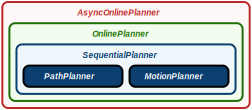

# MPSV
The **M**otion **P**lanner for **S**urface **V**ehicles solves motion planning problems for fully actuated surface vehicles with non-linear dynamics in an environment with non-convex non-moving obstacles.
The method is based on the RRT* algorithm.
The problem is decomposed into two sequential problems in which first a feasible path is searched for and then a collision-free trajectory is calculated based on the path found.
For references, see below.


## Header-only library with MATLAB/Simulink support
The MPSV solver is implemented as header-only library (C++) and requires a compiler that supports the C++20 language features.
There exists a MATLAB/Simulink library with prebuild blocks for windows and linux to use the planner in Simulink.
All blocks are supported for C++ code generation.

**OpenMP**

MPSV requires OpenMP for parallel computing.
It has been tested on Windows via MSYS2/MinGW64 and Ubuntu.
The package usually comes with GCC.
On Ubuntu it can be installed via `sudo apt install libomp-dev`, for example.

## Overview
The directory structure of this repository is as follows.

| File / Directory   | Description                                                                                                    |
| :----------------- | :------------------------------------------------------------------------------------------------------------- |
| apps               | contains example applications                                                                                  |
| documentation      | contains the documentation that has been created with [SimpleDoc](https://github.com/RobertDamerius/SimpleDoc) |
| matlab             | contains the MATLAB/Simulink library "MPSV" (**>= R2023b**) and Simulink examples                              |
| source             | contains the header-only library (C++)                                                                         |
| LICENSE            | license information                                                                                            |
| Makefile           | used to build example applications                                                                             |
| README.md          | this file                                                                                                      |


## Planning Levels
The API of MPSV consists of several planning levels that are shown in the following image.



**PathPlanner**
- find path from initial pose to final pose
- RRT* with fixed number of nodes and warm start capabilities

**MotionPlanner**
- find trajectory from initial state/input to final pose around a given path
- RRT* with fixed number of nodes
- internal control system based on feedback linearization to generate dynamically feasible trajectory

**SequentialPlanner**
- combine path and motion planner in sequential manner
- path from path planner is used as guidance for the motion planner

**OnlinePlanner**
- continuously solve sequential planning problems
- solves motion planning problems for a future timepoint
- merges solution trajectory seamless with a previous solution

**AsyncOnlinePlanner**
- run the online planner in a separate thread
- results are obtained via polling or callback

When using the header-only library the desired planning level can be used directly in a custom C++ application (see examples).
However, when using MATLAB/Simulink, only the *PathPlanner* and the *AsyncOnlinePlanner* are currently implemented.


## Examples (C++)
Take a look to example applications in the [apps](apps/) directory on how to use the different planning levels of MPSV.

#### Building a single example
To build a specific application example, run
```
make app=NAME
```
where `NAME` has to be replaced by the name of the application, e.g. the folder name of the application to be built.

#### Building all examples
To build all example applications, run
```
make apps
```


## Examples (MATLAB/Simulink)
Example models for Simulink are located at [matlab/examples/](matlab/examples/).


## Publication
*Robert Damerius and Torsten Jeinsch, Real-Time Path Planning for Fully Actuated Autonomous Surface Vehicles, 2022 30th Mediterranean Conference on Control and Automation (MED), 2022, doi: 10.1109/MED54222.2022.9837178*
```
@inproceedings{Damerius2022,
    author    = {Damerius, Robert and Jeinsch, Torsten},
    title     = {{Real-Time Path Planning for Fully Actuated Autonomous Surface Vehicles}}, 
    booktitle = {2022 30th Mediterranean Conference on Control and Automation (MED)}, 
    volume    = {},
    number    = {},
    pages     = {508-513},
    year      = {2022},
    doi       = {10.1109/MED54222.2022.9837178}
}
```

*Robert Damerius, Johannes R. Marx and Torsten Jeinsch, Fast Trajectory Generation on a Path using Feedback Linearization, 22nd IFAC World Congress, 2023, doi: 10.1016/j.ifacol.2023.10.796*
```
@article{Damerius2023,
    author    = {Robert Damerius and Johannes R. Marx and Torsten Jeinsch},
    title     = {{Fast Trajectory Generation on a Path using Feedback Linearization}},
    note      = {22nd IFAC World Congress},
    journal   = {IFAC-PapersOnLine},
    volume    = {56},
    number    = {2},
    pages     = {10990-10995},
    issn      = {2405-8963},
    year      = {2023},
    doi       = {10.1016/j.ifacol.2023.10.796}
}
```

